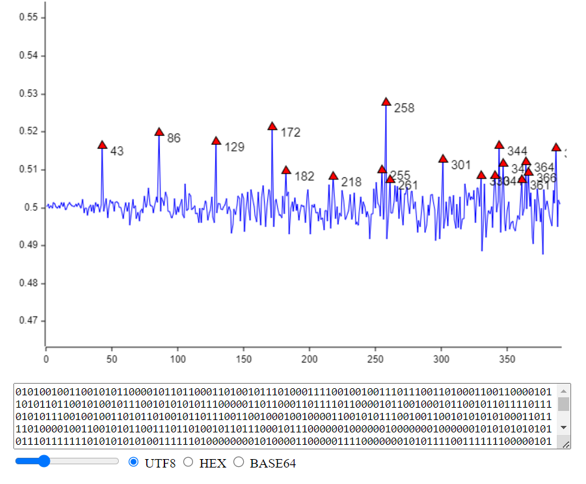

## About

An implementation of the [Kullback Test](https://corgi.rip/blog/kullback-in-ctf/) in Rust, compiled to
WebAssembly to work in the browser.

## Usage

You can play around with the compiled version [here](https://corgi.rip/kullback). 

If you want to yourself, install [wasm-pack](https://github.com/rustwasm/wasm-pack)
then run `wasm-pack build --target web`. The `pkg/` directory should now have all the necessary files, which
`test.html` can load and use.

## License

Licensed under the [MIT license](http://opensource.org/licenses/MIT).
